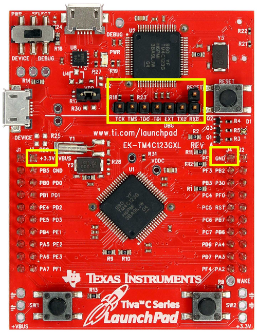

# EK-TM4C123GXL

## Debugging with JLink SWD

1. Solder a strip header to DBG
2. Move switch to position DEVICE (Avoid conflicts to TI-ICDI)
3. Connect pin EXTDBG to ground (disable TI-ICDI)
4. Connect +3V3 to jtag pin 1
5. Connect GND to jtag pin 4
6. Connect TCK to jtag pin 9 (SWCLK)
7. Connect TMS to jtag pin 7 (SWDIO)
8. Connect RESET to jtag pin 15 (nRST)

## Extra changes

1. Remove resistors R9 and R10.
2. Solder resistors R25 and R29 (0 ohm)

## Demos

1. [`demo/ek_tm4c123xgl`](../demo/ek_tm4c123xgl/README.md): LEDs, user switches and trace UART
2. [`demo/ek_tm4c123xgl_boostxl_k350qvg_s1`](../demo/ek_tm4c123xgl_boostxl_k350qvg_s1/README.md): BOOSTXL-K350QVG-S1 display over SPI

Build with `cmake --preset tm4c123gh6pm` and `cmake --build --preset tm4c123gh6pm-RelWithDebInfo --target <target>`; see [demo/README.md](../demo/README.md) for the target names.
